# CI/CD PR Notification

GitHub Actions workflow templates that send automated notifications to **Discord**, **Slack**, or **Custom Webhooks** when pull requests are opened, updated, closed, or merged.

## 🎯 Choose Your Platform

Pick the notification platform that works best for your team:

- 💬 **[Discord](#-discord-notification)** - Rich embeds with color-coded events
- 💼 **[Slack](#-slack-notification)** - Native Slack attachments and formatting
- 🔧 **[Custom Webhook](#-custom-webhook-notification)** - Route to any webhook endpoint

## 📋 Overview

These workflows automatically send rich notifications for pull request events, including:
- 🆕 New PR opened
- 📝 PR updated (new commits)
- 🔄 PR reopened
- ✅ PR merged
- ❌ PR closed (without merging)

### ✨ Enhanced Features
- 👤 **Author avatars** - Shows PR author's profile picture (works with forks!)
- 📁 **Detailed file analysis** - File type breakdown, added/removed/modified counts
- 📝 **Changed files list** - See which files were modified
- 📊 **Comprehensive statistics** - Commits, lines changed, file operations
- 🔀 **Fork detection** - Automatically detects and displays fork PRs
- 🔒 **Fork-safe** - Uses `pull_request_target` for secure fork support

> 📸 **Want to see what the notifications look like?** Check out [SAMPLE_OUTPUTS.md](SAMPLE_OUTPUTS.md) for visual examples of Discord, Slack, and Custom webhook notifications!

## 🔄 Workflow Diagram

```mermaid
graph TD
    A[PR Event Triggered] --> B{Event Type?}
    B -->|opened| C[🆕 New PR Opened]
    B -->|synchronize| D[📝 PR Updated]
    B -->|reopened| E[🔄 PR Reopened]
    B -->|closed| F{Merged?}
    F -->|Yes| G[✅ PR Merged]
    F -->|No| H[❌ PR Closed]
    
    C --> I[Extract PR Info]
    D --> I
    E --> I
    G --> I
    H --> I
    
    I --> J[Set Color & Title]
    J --> K{Platform?}
    
    K -->|Discord| L[Build Discord Embed]
    K -->|Slack| M[Build Slack Attachment]
    K -->|Custom| N[Build Generic JSON]
    
    L --> O[Send to Discord Webhook]
    M --> P[Send to Slack Webhook]
    N --> Q[Send to Custom Webhook]
    
    O --> R{Success?}
    P --> R
    Q --> R
    
    R -->|Yes| S[✅ Notification Sent]
    R -->|No| T[⚠️ Log Error]
    
    style C fill:#3498db
    style D fill:#f39c12
    style E fill:#9b59b6
    style G fill:#2ecc71
    style H fill:#e74c3c
    style S fill:#2ecc71
    style T fill:#e74c3c
```



---

## 💬 Discord Notification

### Setup

#### 1. Create Discord Webhook

1. Go to your Discord server settings
2. Navigate to **Integrations** → **Webhooks**
3. Click **New Webhook**
4. Copy the webhook URL

#### 2. Add Secret to GitHub

1. Go to your repository **Settings** → **Secrets and variables** → **Actions**
2. Click **New repository secret**
3. Name: `DISCORD_WEBHOOK_URL`
4. Value: Paste your Discord webhook URL
5. Click **Add secret**

#### 3. Copy Workflow

Copy `.github/workflows/discord-pr-notification.yml` to your repository.

### Template

```yaml
name: Discord PR Notification

on:
  pull_request_target:
    branches: ['**']  # Match all branches - scalable for any branch
    types: [opened, closed, reopened, synchronize]

env:
  DISCORD_WEBHOOK_URL: ${{ secrets.DISCORD_WEBHOOK_URL }}

jobs:
  notify-discord:
    name: Send Discord Notification
    runs-on: ubuntu-latest
    permissions:
      contents: read
      pull-requests: read
    steps:
      # SECURITY: Only checkout base branch, never PR code from fork
      - name: Checkout base branch (SECURITY)
        uses: actions/checkout@v4
        with:
          ref: ${{ github.event.pull_request.base.ref }}

      - name: Send Discord notification
        if: env.DISCORD_WEBHOOK_URL != ''
        run: |
          PR_NUMBER="${{ github.event.pull_request.number }}"
          PR_TITLE="${{ github.event.pull_request.title }}"
          PR_URL="${{ github.event.pull_request.html_url }}"
          PR_AUTHOR="${{ github.event.pull_request.user.login }}"
          BASE_BRANCH="${{ github.event.pull_request.base.ref }}"
          HEAD_BRANCH="${{ github.event.pull_request.head.ref }}"
          ADDITIONS="${{ github.event.pull_request.additions }}"
          DELETIONS="${{ github.event.pull_request.deletions }}"
          CHANGED_FILES="${{ github.event.pull_request.changed_files }}"
          
          # Determine event type and color
          EVENT_TYPE="${{ github.event.action }}"
          MERGED="${{ github.event.pull_request.merged }}"
          
          if [ "$EVENT_TYPE" = "opened" ]; then
            COLOR="3447003"  # Blue
            TITLE="🆕 New Pull Request Opened"
            DESCRIPTION="$PR_AUTHOR created a new pull request"
          elif [ "$EVENT_TYPE" = "reopened" ]; then
            COLOR="10181046"  # Purple
            TITLE="🔄 Pull Request Reopened"
            DESCRIPTION="$PR_AUTHOR reopened this pull request"
          elif [ "$EVENT_TYPE" = "closed" ] && [ "$MERGED" = "true" ]; then
            COLOR="5763719"  # Green
            TITLE="✅ Pull Request Merged"
            DESCRIPTION="Pull request was merged"
          elif [ "$EVENT_TYPE" = "closed" ] && [ "$MERGED" = "false" ]; then
            COLOR="15158332"  # Red
            TITLE="❌ Pull Request Closed"
            DESCRIPTION="$PR_AUTHOR closed this pull request without merging"
          elif [ "$EVENT_TYPE" = "synchronize" ]; then
            COLOR="16776960"  # Yellow
            TITLE="📝 Pull Request Updated"
            DESCRIPTION="$PR_AUTHOR pushed new commits"
          else
            COLOR="9807270"  # Gray
            TITLE="📋 Pull Request Event"
            DESCRIPTION="Pull request event: $EVENT_TYPE"
          fi
          
          # Get timestamp
          TIMESTAMP=$(date -u +"%Y-%m-%dT%H:%M:%SZ")
          
          # Escape special characters for JSON
          PR_TITLE_ESCAPED=$(echo "$PR_TITLE" | sed 's/"/\\"/g' | sed ':a;N;$!ba;s/\n/\\n/g')
          DESCRIPTION_ESCAPED=$(echo "$DESCRIPTION" | sed 's/"/\\"/g' | sed ':a;N;$!ba;s/\n/\\n/g')
          
          # Build Discord webhook payload
          cat > discord_payload.json <<EOF
          {
            "username": "GitHub CI/CD",
            "avatar_url": "https://github.githubassets.com/images/modules/logos_page/GitHub-Mark.png",
            "embeds": [
              {
                "title": "$TITLE",
                "description": "$DESCRIPTION_ESCAPED",
                "url": "$PR_URL",
                "color": $COLOR,
                "fields": [
                  {
                    "name": "📋 Pull Request",
                    "value": "[#$PR_NUMBER - $PR_TITLE_ESCAPED]($PR_URL)",
                    "inline": false
                  },
                  {
                    "name": "👤 Author",
                    "value": "[$PR_AUTHOR](https://github.com/$PR_AUTHOR)",
                    "inline": true
                  },
                  {
                    "name": "🌿 Branch",
                    "value": "\`$HEAD_BRANCH\` → \`$BASE_BRANCH\`",
                    "inline": true
                  },
                  {
                    "name": "📊 Changes",
                    "value": "**$CHANGED_FILES** files\n✅ **+$ADDITIONS** lines • ❌ **-$DELETIONS** lines",
                    "inline": false
                  }
                ],
                "footer": {
                  "text": "GitHub Actions • PR Notification",
                  "icon_url": "https://github.githubassets.com/images/modules/logos_page/GitHub-Mark.png"
                },
                "timestamp": "$TIMESTAMP"
              }
            ]
          }
          EOF
          
          # Send to Discord
          echo "Sending notification to Discord..."
          
          RESPONSE=$(curl -X POST "$DISCORD_WEBHOOK_URL" \
            -H "Content-Type: application/json" \
            -d @discord_payload.json \
            -w "\n%{http_code}" \
            -s)
          
          HTTP_CODE=$(echo "$RESPONSE" | tail -n1)
          
          if [ "$HTTP_CODE" = "204" ] || [ "$HTTP_CODE" = "200" ]; then
            echo "✅ Successfully sent Discord notification (HTTP $HTTP_CODE)"
          else
            echo "⚠️ Discord webhook returned HTTP $HTTP_CODE"
            echo "Response: $RESPONSE"
            # Don't fail the workflow if Discord notification fails
          fi
```

---

## 💼 Slack Notification

### Setup

#### 1. Create Slack Webhook

1. Go to [Slack API Apps](https://api.slack.com/apps)
2. Create a new app or select existing app
3. Go to **Incoming Webhooks** → **Activate Incoming Webhooks**
4. Click **Add New Webhook to Workspace**
5. Select channel and copy the webhook URL

#### 2. Add Secret to GitHub

1. Go to your repository **Settings** → **Secrets and variables** → **Actions**
2. Click **New repository secret**
3. Name: `SLACK_WEBHOOK_URL`
4. Value: Paste your Slack webhook URL
5. Click **Add secret**

#### 3. Copy Workflow

Copy `.github/workflows/slack-pr-notification.yml` to your repository.

### Template

```yaml
name: Slack PR Notification

on:
  pull_request_target:
    branches: ['**']  # Match all branches - scalable for any branch
    types: [opened, closed, reopened, synchronize]

env:
  SLACK_WEBHOOK_URL: ${{ secrets.SLACK_WEBHOOK_URL }}

jobs:
  notify-slack:
    name: Send Slack Notification
    runs-on: ubuntu-latest
    permissions:
      contents: read
      pull-requests: read
    steps:
      # SECURITY: Only checkout base branch, never PR code from fork
      - name: Checkout base branch (SECURITY)
        uses: actions/checkout@v4
        with:
          ref: ${{ github.event.pull_request.base.ref }}

      - name: Send Slack notification
        if: env.SLACK_WEBHOOK_URL != ''
        run: |
          PR_NUMBER="${{ github.event.pull_request.number }}"
          PR_TITLE="${{ github.event.pull_request.title }}"
          PR_URL="${{ github.event.pull_request.html_url }}"
          PR_AUTHOR="${{ github.event.pull_request.user.login }}"
          BASE_BRANCH="${{ github.event.pull_request.base.ref }}"
          HEAD_BRANCH="${{ github.event.pull_request.head.ref }}"
          ADDITIONS="${{ github.event.pull_request.additions }}"
          DELETIONS="${{ github.event.pull_request.deletions }}"
          CHANGED_FILES="${{ github.event.pull_request.changed_files }}"
          
          # Determine event type and color
          EVENT_TYPE="${{ github.event.action }}"
          MERGED="${{ github.event.pull_request.merged }}"
          
          if [ "$EVENT_TYPE" = "opened" ]; then
            COLOR="#3498db"  # Blue
            TITLE="🆕 New Pull Request Opened"
            DESCRIPTION="$PR_AUTHOR created a new pull request"
          elif [ "$EVENT_TYPE" = "reopened" ]; then
            COLOR="#9b59b6"  # Purple
            TITLE="🔄 Pull Request Reopened"
            DESCRIPTION="$PR_AUTHOR reopened this pull request"
          elif [ "$EVENT_TYPE" = "closed" ] && [ "$MERGED" = "true" ]; then
            COLOR="#2ecc71"  # Green
            TITLE="✅ Pull Request Merged"
            DESCRIPTION="Pull request was merged"
          elif [ "$EVENT_TYPE" = "closed" ] && [ "$MERGED" = "false" ]; then
            COLOR="#e74c3c"  # Red
            TITLE="❌ Pull Request Closed"
            DESCRIPTION="$PR_AUTHOR closed this pull request without merging"
          elif [ "$EVENT_TYPE" = "synchronize" ]; then
            COLOR="#f39c12"  # Yellow
            TITLE="📝 Pull Request Updated"
            DESCRIPTION="$PR_AUTHOR pushed new commits"
          else
            COLOR="#95a5a6"  # Gray
            TITLE="📋 Pull Request Event"
            DESCRIPTION="Pull request event: $EVENT_TYPE"
          fi
          
          # Get timestamp
          TIMESTAMP=$(date +%s)
          
          # Escape special characters for JSON
          PR_TITLE_ESCAPED=$(echo "$PR_TITLE" | sed 's/"/\\"/g' | sed ':a;N;$!ba;s/\n/\\n/g')
          DESCRIPTION_ESCAPED=$(echo "$DESCRIPTION" | sed 's/"/\\"/g' | sed ':a;N;$!ba;s/\n/\\n/g')
          
          # Build Slack webhook payload
          cat > slack_payload.json <<EOF
          {
            "username": "GitHub CI/CD",
            "icon_url": "https://github.githubassets.com/images/modules/logos_page/GitHub-Mark.png",
            "attachments": [
              {
                "color": "$COLOR",
                "title": "$TITLE",
                "title_link": "$PR_URL",
                "text": "$DESCRIPTION_ESCAPED",
                "fields": [
                  {
                    "title": "📋 Pull Request",
                    "value": "<$PR_URL|#$PR_NUMBER - $PR_TITLE_ESCAPED>",
                    "short": false
                  },
                  {
                    "title": "👤 Author",
                    "value": "<https://github.com/$PR_AUTHOR|$PR_AUTHOR>",
                    "short": true
                  },
                  {
                    "title": "🌿 Branch",
                    "value": "\`$HEAD_BRANCH\` → \`$BASE_BRANCH\`",
                    "short": true
                  },
                  {
                    "title": "📊 Changes",
                    "value": "*$CHANGED_FILES* files\n✅ *+$ADDITIONS* lines • ❌ *-$DELETIONS* lines",
                    "short": false
                  }
                ],
                "footer": "GitHub Actions • PR Notification",
                "footer_icon": "https://github.githubassets.com/images/modules/logos_page/GitHub-Mark.png",
                "ts": $TIMESTAMP
              }
            ]
          }
          EOF
          
          # Send to Slack
          echo "Sending notification to Slack..."
          
          RESPONSE=$(curl -X POST "$SLACK_WEBHOOK_URL" \
            -H "Content-Type: application/json" \
            -d @slack_payload.json \
            -w "\n%{http_code}" \
            -s)
          
          HTTP_CODE=$(echo "$RESPONSE" | tail -n1)
          
          if [ "$HTTP_CODE" = "200" ]; then
            echo "✅ Successfully sent Slack notification (HTTP $HTTP_CODE)"
          else
            echo "⚠️ Slack webhook returned HTTP $HTTP_CODE"
            echo "Response: $RESPONSE"
            # Don't fail the workflow if Slack notification fails
          fi
```

---

## 🔧 Custom Webhook Notification

### Setup

#### 1. Prepare Your Webhook Endpoint

Your endpoint should accept POST requests with JSON payload. The payload format is:

```json
{
  "event": "pull_request",
  "action": "opened|closed|reopened|synchronize",
  "timestamp": "2024-01-01T00:00:00Z",
  "pull_request": {
    "number": 123,
    "title": "PR Title",
    "url": "https://github.com/owner/repo/pull/123",
    "author": "username",
    "author_url": "https://github.com/username",
    "base_branch": "main",
    "head_branch": "feature-branch",
    "merged": false,
    "stats": {
      "files_changed": 5,
      "additions": 100,
      "deletions": 50
    }
  },
  "notification": {
    "title": "🆕 New Pull Request Opened",
    "description": "username created a new pull request",
    "color": "#3498db"
  },
  "repository": {
    "name": "owner/repo",
    "url": "https://github.com/owner/repo"
  }
}
```

#### 2. Add Secret to GitHub

1. Go to your repository **Settings** → **Secrets and variables** → **Actions**
2. Click **New repository secret**
3. Name: `CUSTOM_WEBHOOK_URL`
4. Value: Paste your webhook URL
5. Click **Add secret**

#### 3. (Optional) Configure Method and Headers

If your webhook requires custom HTTP method or headers:

1. Go to **Settings** → **Secrets and variables** → **Actions** → **Variables**
2. Add variable `CUSTOM_WEBHOOK_METHOD` (default: `POST`)
3. Add variable `CUSTOM_WEBHOOK_HEADERS` (format: `Header-Name: value, Another-Header: value`)

#### 4. Copy Workflow

Copy `.github/workflows/custom-webhook-pr-notification.yml` to your repository.

### Template

```yaml
name: Custom Webhook PR Notification

on:
  pull_request_target:
    branches: ['**']  # Match all branches - scalable for any branch
    types: [opened, closed, reopened, synchronize]

env:
  CUSTOM_WEBHOOK_URL: ${{ secrets.CUSTOM_WEBHOOK_URL }}
  CUSTOM_WEBHOOK_METHOD: ${{ vars.CUSTOM_WEBHOOK_METHOD || 'POST' }}
  CUSTOM_WEBHOOK_HEADERS: ${{ vars.CUSTOM_WEBHOOK_HEADERS || 'Content-Type: application/json' }}

jobs:
  notify-custom:
    name: Send Custom Webhook Notification
    runs-on: ubuntu-latest
    permissions:
      contents: read
      pull-requests: read
    steps:
      # SECURITY: Only checkout base branch, never PR code from fork
      - name: Checkout base branch (SECURITY)
        uses: actions/checkout@v4
        with:
          ref: ${{ github.event.pull_request.base.ref }}

      - name: Send Custom Webhook notification
        if: env.CUSTOM_WEBHOOK_URL != ''
        run: |
          PR_NUMBER="${{ github.event.pull_request.number }}"
          PR_TITLE="${{ github.event.pull_request.title }}"
          PR_URL="${{ github.event.pull_request.html_url }}"
          PR_AUTHOR="${{ github.event.pull_request.user.login }}"
          BASE_BRANCH="${{ github.event.pull_request.base.ref }}"
          HEAD_BRANCH="${{ github.event.pull_request.head.ref }}"
          ADDITIONS="${{ github.event.pull_request.additions }}"
          DELETIONS="${{ github.event.pull_request.deletions }}"
          CHANGED_FILES="${{ github.event.pull_request.changed_files }}"
          
          # Determine event type and color
          EVENT_TYPE="${{ github.event.action }}"
          MERGED="${{ github.event.pull_request.merged }}"
          
          if [ "$EVENT_TYPE" = "opened" ]; then
            COLOR="#3498db"  # Blue
            TITLE="🆕 New Pull Request Opened"
            DESCRIPTION="$PR_AUTHOR created a new pull request"
          elif [ "$EVENT_TYPE" = "reopened" ]; then
            COLOR="#9b59b6"  # Purple
            TITLE="🔄 Pull Request Reopened"
            DESCRIPTION="$PR_AUTHOR reopened this pull request"
          elif [ "$EVENT_TYPE" = "closed" ] && [ "$MERGED" = "true" ]; then
            COLOR="#2ecc71"  # Green
            TITLE="✅ Pull Request Merged"
            DESCRIPTION="Pull request was merged"
          elif [ "$EVENT_TYPE" = "closed" ] && [ "$MERGED" = "false" ]; then
            COLOR="#e74c3c"  # Red
            TITLE="❌ Pull Request Closed"
            DESCRIPTION="$PR_AUTHOR closed this pull request without merging"
          elif [ "$EVENT_TYPE" = "synchronize" ]; then
            COLOR="#f39c12"  # Yellow
            TITLE="📝 Pull Request Updated"
            DESCRIPTION="$PR_AUTHOR pushed new commits"
          else
            COLOR="#95a5a6"  # Gray
            TITLE="📋 Pull Request Event"
            DESCRIPTION="Pull request event: $EVENT_TYPE"
          fi
          
          # Get timestamp
          TIMESTAMP=$(date -u +"%Y-%m-%dT%H:%M:%SZ")
          
          # Escape special characters for JSON
          PR_TITLE_ESCAPED=$(echo "$PR_TITLE" | sed 's/"/\\"/g' | sed ':a;N;$!ba;s/\n/\\n/g')
          DESCRIPTION_ESCAPED=$(echo "$DESCRIPTION" | sed 's/"/\\"/g' | sed ':a;N;$!ba;s/\n/\\n/g')
          
          # Build custom webhook payload (generic JSON format)
          cat > custom_payload.json <<EOF
          {
            "event": "pull_request",
            "action": "$EVENT_TYPE",
            "timestamp": "$TIMESTAMP",
            "pull_request": {
              "number": $PR_NUMBER,
              "title": "$PR_TITLE_ESCAPED",
              "url": "$PR_URL",
              "author": "$PR_AUTHOR",
              "author_url": "https://github.com/$PR_AUTHOR",
              "base_branch": "$BASE_BRANCH",
              "head_branch": "$HEAD_BRANCH",
              "merged": $MERGED,
              "stats": {
                "files_changed": $CHANGED_FILES,
                "additions": $ADDITIONS,
                "deletions": $DELETIONS
              }
            },
            "notification": {
              "title": "$TITLE",
              "description": "$DESCRIPTION_ESCAPED",
              "color": "$COLOR"
            },
            "repository": {
              "name": "${{ github.repository }}",
              "url": "${{ github.event.repository.html_url }}"
            }
          }
          EOF
          
          # Parse headers if provided
          HEADER_ARGS=""
          if [ -n "$CUSTOM_WEBHOOK_HEADERS" ]; then
            echo "$CUSTOM_WEBHOOK_HEADERS" | tr ',' '\n' | while IFS= read -r header; do
              if [ -n "$header" ]; then
                HEADER_ARGS="$HEADER_ARGS -H \"$header\""
              fi
            done
          fi
          
          # Default to Content-Type if no headers specified
          if [ -z "$HEADER_ARGS" ]; then
            HEADER_ARGS='-H "Content-Type: application/json"'
          fi
          
          # Send to Custom Webhook
          echo "Sending notification to custom webhook..."
          echo "Method: ${CUSTOM_WEBHOOK_METHOD:-POST}"
          echo "URL: $CUSTOM_WEBHOOK_URL"
          
          # Use eval to handle dynamic headers (safe in this context)
          RESPONSE=$(eval curl -X "${CUSTOM_WEBHOOK_METHOD:-POST}" "$CUSTOM_WEBHOOK_URL" \
            $HEADER_ARGS \
            -d @custom_payload.json \
            -w "\n%{http_code}" \
            -s)
          
          HTTP_CODE=$(echo "$RESPONSE" | tail -n1)
          
          if [ "$HTTP_CODE" = "200" ] || [ "$HTTP_CODE" = "201" ] || [ "$HTTP_CODE" = "204" ]; then
            echo "✅ Successfully sent custom webhook notification (HTTP $HTTP_CODE)"
          else
            echo "⚠️ Custom webhook returned HTTP $HTTP_CODE"
            echo "Response: $RESPONSE"
            # Don't fail the workflow if custom webhook notification fails
          fi
```

---

## 🔒 Security Features

All workflows include:
- Uses `pull_request_target` event for security (works with forks)
- Only checks out the base branch, never PR code from untrusted forks
- Minimal permissions required (`contents: read`, `pull-requests: read`)

## 🎨 Notification Features

Each notification includes:
- **Author avatar/thumbnail** - Profile picture of PR author (works with forks!)
- **Color-coded messages** based on event type
- **PR details**: Number, title, and link
- **Author information**: GitHub username with profile link
- **Branch information**: Source → Target branch
- **Detailed change statistics**: 
  - Files changed, commits count
  - Lines added/removed
  - File breakdown (added/removed/modified/renamed)
  - File type analysis (top 5 file types)
- **Changed files list** - Shows up to 8 files with full list indicator
- **Timestamp**: When the event occurred

## ⚙️ Customization

### Change Target Branches

By default, workflows match **all branches** (`branches: ['**']`). To limit to specific branches, edit the `branches` array:

```yaml
on:
  pull_request_target:
    branches: [main, master, develop, release/*]  # Specific branches only
    # Or use ['**'] to match all branches (default)
```

### Change Event Types

Modify the `types` array to listen to different events:

```yaml
types: [opened, closed, reopened, synchronize, ready_for_review]
```

### Customize Colors

Edit the color values in the workflow script:
- **Discord**: Uses decimal colors (e.g., `3447003` for blue)
- **Slack**: Uses hex colors (e.g., `#3498db` for blue)
- **Custom**: Uses hex colors (e.g., `#3498db` for blue)

Color meanings:
- 🔵 Blue: New PR
- 🟡 Yellow: Updated PR
- 🟣 Purple: Reopened PR
- 🟢 Green: Merged PR
- 🔴 Red: Closed PR

## 📄 License

See [LICENSE](LICENSE) file for details.
